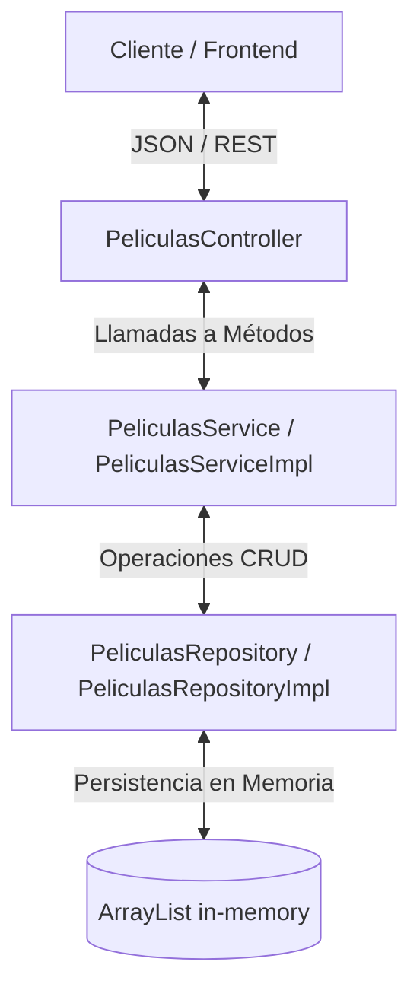

# 🎬 Proyecto: Gestión de Películas en Memoria

Este proyecto es una aplicación web construida con **Spring Boot** y **Java 17** para la administración de un catálogo de películas y sus respectivos comentarios utilizando persistencia en memoria.

---

## 🏗️ Arquitectura del Proyecto

El proyecto sigue una arquitectura clásica de capas para desacoplar las responsabilidades:



### 📂 Estructura de Paquetes y Clases Principales

A continuación se detallan las clases principales ubicadas bajo la ruta de código fuente:
[src/main/java/cl/usm/gestionPeliculasMemoria](file:///C:/Users/Alumnos_IBT/Desktop/gestion_peliculas_memoria/src/main/java/cl/usm/gestionPeliculasMemoria)

- 📁 [**controllers**](file:///C:/Users/Alumnos_IBT/Desktop/gestion_peliculas_memoria/src/main/java/cl/usm/gestionPeliculasMemoria/controllers):
  - [PeliculasController.java](file:///C:/Users/Alumnos_IBT/Desktop/gestion_peliculas_memoria/src/main/java/cl/usm/gestionPeliculasMemoria/controllers/PeliculasController.java): Expone la API REST y maneja las solicitudes HTTP y códigos de estado.
- 📁 [**services**](file:///C:/Users/Alumnos_IBT/Desktop/gestion_peliculas_memoria/src/main/java/cl/usm/gestionPeliculasMemoria/services):
  - [PeliculasService.java](file:///C:/Users/Alumnos_IBT/Desktop/gestion_peliculas_memoria/src/main/java/cl/usm/gestionPeliculasMemoria/services/PeliculasService.java): Interfaz que define las reglas de negocio.
  - [PeliculasServiceImpl.java](file:///C:/Users/Alumnos_IBT/Desktop/gestion_peliculas_memoria/src/main/java/cl/usm/gestionPeliculasMemoria/services/PeliculasServiceImpl.java): Implementación que añade lógica de negocio (como la generación segura del token de descarga).
- 📁 [**repositories**](file:///C:/Users/Alumnos_IBT/Desktop/gestion_peliculas_memoria/src/main/java/cl/usm/gestionPeliculasMemoria/repositories):
  - [PeliculasRepository.java](file:///C:/Users/Alumnos_IBT/Desktop/gestion_peliculas_memoria/src/main/java/cl/usm/gestionPeliculasMemoria/repositories/PeliculasRepository.java): Interfaz para el acceso a datos.
  - [PeliculasRepositoryImpl.java](file:///C:/Users/Alumnos_IBT/Desktop/gestion_peliculas_memoria/src/main/java/cl/usm/gestionPeliculasMemoria/repositories/PeliculasRepositoryImpl.java): Implementación que almacena las entidades en una lista (`ArrayList`) en memoria de forma no persistente.
- 📁 [**entities**](file:///C:/Users/Alumnos_IBT/Desktop/gestion_peliculas_memoria/src/main/java/cl/usm/gestionPeliculasMemoria/entities):
  - [Pelicula.java](file:///C:/Users/Alumnos_IBT/Desktop/gestion_peliculas_memoria/src/main/java/cl/usm/gestionPeliculasMemoria/entities/Pelicula.java): Modelo que representa una película (con campos `id`, `titulo`, `director`, `tokenDescarga` y comentarios).
  - [Comentario.java](file:///C:/Users/Alumnos_IBT/Desktop/gestion_peliculas_memoria/src/main/java/cl/usm/gestionPeliculasMemoria/entities/Comentario.java): Modelo que representa un comentario de usuario (`usuario` y `comentario`).

---

## 🛠️ Tecnologías y Librerías Utilizadas

- **Java 17** (LTS)
- **Spring Boot 4.0.5**
  - `spring-boot-starter-web` (Desarrollo REST API)
  - `spring-boot-starter-validation` (Validación de beans/entidades con `@NotBlank`)
- **Lombok**: Para reducir el código repetitivo (`@Getter`, `@Setter`, `@AllArgsConstructor`, `@NoArgsConstructor`, `@ToString`).
- **Apache Commons Lang 3 (3.20.0)**: Utilizado para la generación de tokens aleatorios seguros con `RandomStringUtils.secure()`.
- **JUnit 5 & Mockito**: Para pruebas unitarias.

---

## 🌐 Especificación de la API REST

La aplicación escucha peticiones en el puerto **`8094`** (configurado en [application.properties](file:///C:/Users/Alumnos_IBT/Desktop/gestion_peliculas_memoria/src/main/resources/application.properties)).

| Método | Endpoint | Descripción | Parámetros / Body | Respuestas |
| :--- | :--- | :--- | :--- | :--- |
| **GET** | `/peliculas` | Obtiene el catálogo completo de películas o filtra según término. | `q` (opcional query string) - Filtra por `id` o `titulo` (búsqueda parcial case-insensitive). | **200 OK**: Lista de películas.<br>**500 Internal Error**. |
| **POST** | `/peliculas` | Registra una película nueva. Genera un token alfanumérico seguro de 10 caracteres. | `RequestBody` de tipo `Pelicula` (valida que `id`, `titulo` y `director` no estén vacíos). | **200 OK**: Película creada con su token generado.<br>**500 Internal Error** (ej. ID duplicado). |
| **GET** | `/peliculas/{id}` | Obtiene los detalles de una película por su ID único. | `id` (path variable) | **200 OK**: Objeto Película.<br>**404 Not Found**: Si la película no existe.<br>**500 Internal Error**. |
| **GET** | `/peliculas/{id}/comentarios` | Obtiene los comentarios de una película. | `id` (path variable) | **200 OK**: Arreglo de Comentarios.<br>**404 Not Found**: Si la película no existe.<br>**500 Internal Error**. |

> [!NOTE]
> Puedes consultar la definición OpenAPI completa del proyecto en el archivo [docs/openapi.yaml](file:///C:/Users/Alumnos_IBT/Desktop/gestion_peliculas_memoria/docs/openapi.yaml).

---

## 🧪 Normas y Límites Obligatorios para Tests Unitarios

Si vas a agregar o evaluar tests unitarios en este proyecto, es **crucial** seguir estrictamente las siguientes reglas especificadas en [LIMITES_TESTS.md](file:///C:/Users/Alumnos_IBT/Desktop/gestion_peliculas_memoria/LIMITES_TESTS.md):

> [!IMPORTANT]
> **Elementos Permitidos:**
> - **JUnit 5 (Jupiter):** Uso únicamente de `@Test` y `@BeforeEach`. Aserciones estáticas exclusivas desde `org.junit.jupiter.api.Assertions.*` (`assertEquals`, `assertThrows`).
> - **Mockito:** Uso de `@ExtendWith(MockitoExtension.class)` sobre la clase de pruebas, `@Mock` para definir dependencias, y para el comportamiento usar únicamente `when(...).thenReturn(...)` / `when(...).thenThrow(...)` con matchers como `anyString()`, `anyDouble()`.
> - **Spring Boot Test:** `@SpringBootTest` se restringe exclusivamente al test automático de carga de contexto (`contextLoads`).
> - **Inyección y Estilo:** Inyectar los mocks directamente por constructor en el método `@BeforeEach` donde se instancia manualmente la clase bajo prueba. Los nombres de los tests deben tener el sufijo `Ok` para el camino exitoso y `Nok` para el camino de error.
> - **Controladores:** Verificar que la respuesta HTTP tenga el `HttpStatus` esperado a partir del `ResponseEntity`.

> [!WARNING]
> **Elementos Prohibidos (NO utilizar bajo ningún motivo):**
> - AssertJ (`assertThat`) ni Hamcrest.
> - MockMvc, `@WebMvcTest` ni `@InjectMocks`.
> - `@ParameterizedTest`, `@DisplayName` ni `@Nested`.
> - Verificaciones avanzadas de Mockito como `verify()` y `spy()`.
> - `@DataJpaTest` o librerías externas de cobertura.

---

## 🚀 Cómo Ejecutar el Proyecto

### Requisitos previos
- Tener instalado **Java 17** o superior.
- Maven (o utilizar el wrapper `mvnw` incluido).

### Compilar y Ejecutar en modo desarrollo
Para compilar y levantar el servidor de desarrollo en el puerto `8094`, ejecuta el siguiente comando en la raíz del proyecto:

```powershell
./mvnw spring-boot:run
```

### Ejecutar las Pruebas Unitarias
Para correr los tests configurados en el proyecto, ejecuta:

```powershell
./mvnw test
```
